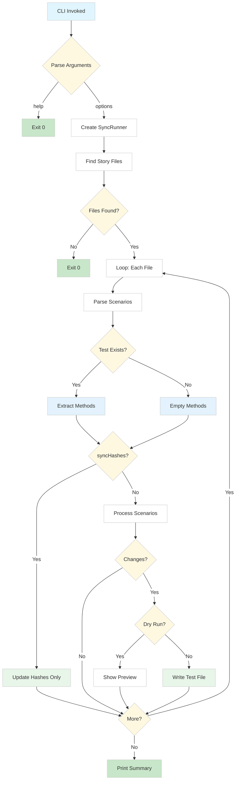

# Verteller

Story-driven test scaffolding for PHPUnit.

*Verteller* is Dutch for "storyteller".

## What it does

Verteller bridges the gap between requirements and tests by syncing Gherkin-like `.story` files to PHPUnit test stubs:

- **Generates test scaffolding** - Creates PHPUnit test methods from story scenarios, so you focus on implementation rather than boilerplate
- **Keeps tests in sync** - When you add new scenarios to a story, Verteller adds the corresponding test methods (existing implementations remain untouched)
- **Detects story changes** - Each scenario's steps are hashed; when the steps change, Verteller warns you that the test may need review
- **Supports CI validation** - Run with `--validate` to fail builds when tests are out of sync with stories
- **Links tests to requirements** - The `#[CoversStory]` attribute creates traceability between your tests and the scenarios they implement

The workflow is simple: write your requirements as scenarios, run Verteller to generate test stubs, then implement the test logic. As requirements evolve, Verteller keeps your test structure aligned.

## Why not Behat or Codeception?

Tools like Behat and Codeception use **step definitions** - reusable code snippets mapped to Gherkin steps like "Given a user exists". This approach has drawbacks:

- **Step rot** - Step definitions accumulate over time, becoming hard to maintain and inconsistent
- **Hidden complexity** - The actual test logic is scattered across step files, making tests harder to understand
- **Regex fragility** - Step matching via patterns breaks easily when wording changes

Verteller takes a different approach: **no step definitions**. Each scenario becomes a single test method where you write plain PHPUnit code. The story text serves as documentation, not executable code.

### Minimal syntax

Verteller only requires three keywords: `Scenario`, `Scenario Outline`, and `Examples`. Everything else is free-form - write whatever makes sense for your team:

```gherkin
Scenario: User upgrades to premium
    User clicks upgrade button
    Payment form appears
    User enters valid card details
    Subscription is activated
    Welcome email is sent
```

No `Given`/`When`/`Then` required. No step matching. Just human-readable descriptions that become test documentation.
I would recommend using such a syntax, but it's optional.

### Two-way sync protection

Verteller protects against both forms of rot:

| Problem | What happens | How Verteller helps |
|---------|--------------|---------------------|
| **Story rot** | Stories become outdated, no longer reflecting actual behaviour | `#[CoversStory]` links tests to scenarios; orphaned tests (scenario removed) trigger warnings |
| **Test rot** | Tests drift from requirements, testing something different than documented | Hash-based change detection warns when scenario steps change, prompting test review |

The `--validate` flag in CI ensures stories and tests stay synchronised - builds fail if they diverge.

## Installation

```bash
composer require --dev rdekat/verteller
```

## Quick Start

1. Create a `.story` file describing your feature:

```gherkin
Scenario: User logs in successfully
    Given a registered user with email "test@example.com"
    When they submit the login form with correct password
    Then they should be authenticated
```

2. Run Verteller to generate test stubs:

```bash
vendor/bin/verteller.php
```

3. Implement the generated test methods.

## Usage

### CLI Commands

```bash
# Sync stories in current directory
vendor/bin/verteller.php

# Preview changes without writing files
vendor/bin/verteller.php --dry-run

# CI mode: fail if tests are out of sync with stories
vendor/bin/verteller.php --validate

# Update hashes only (after reviewing story changes)
vendor/bin/verteller.php --sync-hashes

# Specify project directory
vendor/bin/verteller.php /path/to/project
```

### Story File Format

Story files use a Gherkin-like syntax with `Scenario` and `Scenario Outline`:

```gherkin
Feature: User Authentication

Scenario: Successful login with valid credentials
    Given a registered user with email "test@example.com"
    When they submit the login form with correct password
    Then they should be authenticated
    And redirected to the dashboard

Scenario Outline: Login validation errors
    Given a login form
    When the user submits with <email> and <password>
    Then they should see error <message>

    Examples:
        | email            | password | message                |
        | invalid          | secret   | Invalid email format   |
        | test@example.com |          | Password is required   |
```

### Generated Tests

For each scenario, Verteller generates a test method with:

- `#[CoversStory]` attribute linking the test to its story
- The scenario text embedded as a comment
- A `markTestIncomplete()` call for you to replace

```php
<?php
declare(strict_types=1);

namespace App\Domains\Auth\Backend\Tests\Story;

use PHPUnit\Framework\TestCase;
use Verteller\Attributes\CoversStory;

final class UserAuthenticationTest extends TestCase
{
    #[CoversStory(
        storyFile: 'src/Domains/Auth/Stories/UserAuthentication.story',
        scenario: 'Successful login with valid credentials',
        hash: 'a1b2c3d4'
    )]
    public function test_successful_login_with_valid_credentials(): void
    {
        /*
            Scenario: Successful login with valid credentials
            Given a registered user with email "test@example.com"
            When they submit the login form with correct password
            Then they should be authenticated
            And redirected to the dashboard
        */
        self::markTestIncomplete('This test is auto-generated from the story and needs implementation.');
    }
}
```

Scenario Outlines become tests with PHPUnit data providers:

```php
#[CoversStory(storyFile: '...', scenario: 'Login validation errors', hash: 'e5f6g7h8')]
#[DataProvider('login_validation_errors_provider')]
public function test_login_validation_errors(array $row): void
{
    // $row contains: ['email' => '...', 'password' => '...', 'message' => '...']
    self::markTestIncomplete('...');
}

public static function login_validation_errors_provider(): array
{
    return [
        [['email' => 'invalid', 'password' => 'secret', 'message' => 'Invalid email format']],
        [['email' => 'test@example.com', 'password' => '', 'message' => 'Password is required']],
    ];
}
```

## Features

- **Automatic scaffolding** - Generate test stubs from story files
- **Incremental updates** - Add new methods when scenarios are added (existing methods untouched)
- **Data providers** - Scenario Outlines with Examples tables become PHPUnit data providers
- **Change detection** - Hash-based tracking warns when scenario steps change
- **CI integration** - `--validate` mode fails if tests are out of sync
- **Traceability** - `#[CoversStory]` attribute links tests to requirements

## How it works



For the complete diagram with file references, see [flowchart (markdown)](docs/flowchart_sync_process.md) or [flowchart (html)](docs/flowchart_sync_process.html).

## Default Project Structure

Verteller expects this structure by default:

```
src/Domains/
├── Auth/
│   ├── Stories/
│   │   └── UserAuthentication.story
│   └── Backend/
│       └── Tests/
│           └── Story/
│               └── UserAuthenticationTest.php  ← Generated
```

## Custom Project Structure

The default CLI (`vendor/bin/verteller.php`) works with the domain-driven structure shown above. For different project structures, create your own runner script - it's just a few lines.

### Creating a custom runner

Create `bin/sync-stories.php` in your project:

```php
<?php

declare(strict_types=1);

require __DIR__ . '/../vendor/autoload.php';

use Verteller\NamespaceResolverInterface;
use Verteller\SyncRunner;

// Define how story paths map to test namespaces and directories
$resolver = new class implements NamespaceResolverInterface {
    public function resolve(string $storyFilePath, string $basePath): string
    {
        // Example: stories/User.story → Tests\Story
        return 'Tests\\Story';
    }

    public function resolveTestDir(string $storyFilePath, string $basePath): string
    {
        // Example: stories/User.story → tests/Story/
        return $basePath . '/tests/Story';
    }
};

// Parse CLI arguments
$args = array_slice($argv, 1);
$dryRun = in_array('--dry-run', $args, true);
$validate = in_array('--validate', $args, true);
$syncHashes = in_array('--sync-hashes', $args, true);

// Run sync - storyDir is relative to basePath
$runner = new SyncRunner(
    basePath: dirname(__DIR__),
    storyDir: 'stories',
    namespaceResolver: $resolver
);

$runner->run(dryRun: $dryRun, validate: $validate, syncHashes: $syncHashes);
$runner->printSummary();

exit($runner->getExitCode(validate: $validate));
```

Then run it:

```bash
php bin/sync-stories.php
php bin/sync-stories.php --dry-run
php bin/sync-stories.php --validate
php bin/sync-stories.php --sync-hashes
```

### Namespace resolver examples

**Simple flat structure** (`stories/*.story` → `tests/Story/*Test.php`):

```php
$resolver = new class implements NamespaceResolverInterface {
    public function resolve(string $storyFilePath, string $basePath): string
    {
        return 'Tests\\Story';
    }

    public function resolveTestDir(string $storyFilePath, string $basePath): string
    {
        return $basePath . '/tests/Story';
    }
};
```

**Colocated with source** (`src/Auth/Stories/*.story` → `src/Auth/Tests/Story/*Test.php`):

```php
$resolver = new class implements NamespaceResolverInterface {
    public function resolve(string $storyFilePath, string $basePath): string
    {
        // src/Auth/Stories/Login.story → App\Auth\Tests\Story
        $relative = str_replace($basePath . '/src/', '', dirname($storyFilePath));
        $parts = array_filter(
            explode(DIRECTORY_SEPARATOR, $relative),
            fn($part) => $part !== 'Stories'
        );

        return 'App\\' . implode('\\', $parts) . '\\Tests\\Story';
    }

    public function resolveTestDir(string $storyFilePath, string $basePath): string
    {
        // src/Auth/Stories/Login.story → src/Auth/Tests/Story/
        return str_replace(
            DIRECTORY_SEPARATOR . 'Stories',
            DIRECTORY_SEPARATOR . 'Tests' . DIRECTORY_SEPARATOR . 'Story',
            dirname($storyFilePath)
        );
    }
};
```

## Example

See the [`example/`](example/) directory for a complete working example with:
- A custom runner script
- A sample story file
- The generated test output

```bash
# Run the example
php example/bin/sync-stories.php --dry-run
```

## Requirements

- PHP 8.4+
- PHPUnit 11+ (for running generated tests)

## Contributing

This is a personal project that suits my needs. Pull requests are not accepted, but I do encourage discussion. I will fix bugs, but will not add features that I do not need in my projects. Feel free to fork if you'd like to make changes.

## License

MIT
