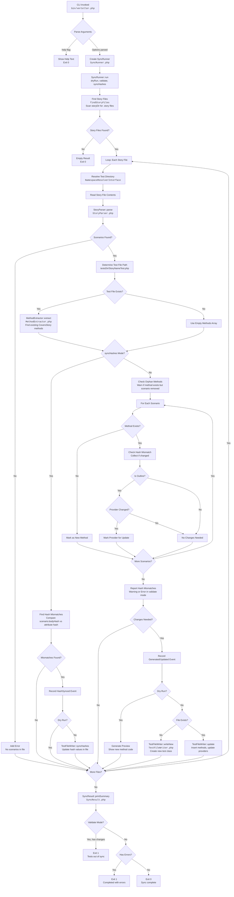

# Sync Process Flowchart

This diagram shows the complete sync process with file references.

```mermaid
flowchart TD
    A[CLI Invoked<br/><code>bin/verteller.php</code>] --> B{Parse Arguments}

    B -->|help flag| C[Show Help Text<br/>Exit 0]
    B -->|Options parsed| D[Create SyncRunner<br/><code>SyncRunner.php</code>]

    D --> E[SyncRunner::run<br/>dryRun, validate, syncHashes]

    E --> F[Find Story Files<br/><code>findStoryFiles</code><br/>Scan storyDir for .story files]

    F --> G{Story Files Found?}
    G -->|No| H[Empty Result<br/>Exit 0]
    G -->|Yes| I[Loop: Each Story File]

    I --> J[Resolve Test Directory<br/><code>NamespaceResolverInterface</code>]

    J --> K[Read Story File Contents]

    K --> L[StoryParser::parse<br/><code>StoryParser.php</code>]

    L --> M{Scenarios Found?}
    M -->|No| N[Add Error<br/>No scenarios in file]
    N --> NEXT{More Files?}

    M -->|Yes| O[Determine Test File Path<br/>testsDir/StoryNameTest.php]

    O --> P{Test File Exists?}

    P -->|Yes| R[MethodExtractor::extract<br/><code>MethodExtractor.php</code><br/>Find existing CoversStory methods]
    P -->|No| R2[Use Empty Methods Array]

    R --> S{syncHashes Mode?}
    R2 --> S

    S -->|Yes| T[Find Hash Mismatches<br/>Compare scenario.bodyHash vs attribute hash]

    T --> U{Mismatches Found?}
    U -->|No| NEXT
    U -->|Yes| V[Record HashSynced Event]

    V --> W{Dry Run?}
    W -->|Yes| NEXT
    W -->|No| X[TestFileWriter::syncHashes<br/>Update hash values in file]
    X --> NEXT

    S -->|No| Y[Check Orphan Methods<br/>Warn if method exists but scenario removed]

    Y --> Z[For Each Scenario]

    Z --> AA{Method Exists?}
    AA -->|No| AB[Mark as New Method]
    AA -->|Yes| AC[Check Hash Mismatch<br/>Collect if changed]

    AC --> AE{Is Outline?}
    AE -->|Yes| AF{Provider Changed?}
    AF -->|Yes| AG[Mark Provider for Update]
    AF -->|No| AH[No Changes Needed]
    AE -->|No| AH

    AB --> AI{More Scenarios?}
    AG --> AI
    AH --> AI

    AI -->|Yes| Z
    AI -->|No| AD[Report Hash Mismatches<br/>Warning or Error in validate mode]

    AD --> AJ{Changes Needed?}

    AJ -->|No| NEXT
    AJ -->|Yes| AK[Record Generated/Updated Event]

    AK --> AL{Dry Run?}
    AL -->|Yes| AM[Generate Preview<br/>Show new method code]
    AM --> NEXT

    AL -->|No| AN{File Exists?}
    AN -->|No| AO[TestFileWriter::writeNew<br/><code>TestFileWriter.php</code><br/>Create new test class]
    AN -->|Yes| AP[TestFileWriter::update<br/>Insert methods, update providers]

    AO --> NEXT
    AP --> NEXT

    NEXT -->|Yes| I
    NEXT -->|No| AQ[SyncResult::printSummary<br/><code>SyncResult.php</code>]

    AQ --> AR{Validate Mode?}
    AR -->|Yes, has changes| AS[Exit 1<br/>Tests out of sync]
    AR -->|No| AT{Has Errors?}
    AT -->|Yes| AU[Exit 1<br/>Completed with errors]
    AT -->|No| AV[Exit 0<br/>Sync complete]
```
